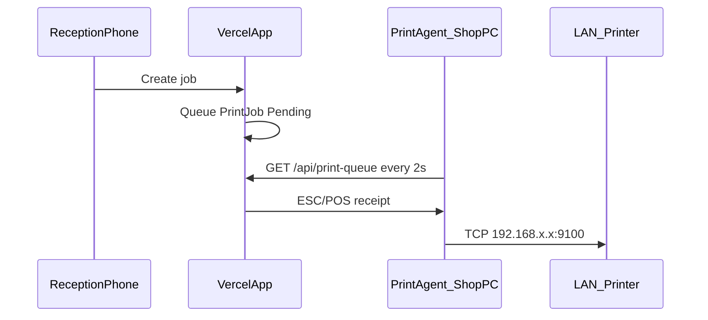

# Thermal Printer Setup

## Architecture



The app runs in the cloud (Vercel). The **print agent** runs on a shop PC on the same LAN as the printer.

---

## Shop PC setup (production)

### 1. Requirements

- Windows PC on the **same Wi‑Fi/LAN** as the printer
- Node.js 20+ installed
- Printer static IP (e.g. `192.168.1.87`), port **9100** open

Verify from shop PC:

```powershell
Test-NetConnection -ComputerName 192.168.1.87 -Port 9100
```

Expect `TcpTestSucceeded : True`.

### 2. Clone project

```bash
git clone https://github.com/anishjak-png/uma_service.git
cd uma_service
npm install
```

### 3. Create `.env` on shop PC

```env
PRINT_AGENT_APP_URL="https://uma-service.vercel.app"
PRINT_AGENT_API_KEY="your-shared-secret"
THERMAL_PRINTER_HOST="192.168.1.87"
THERMAL_PRINTER_PORT="9100"
```

**Important:** `PRINT_AGENT_API_KEY` must match the value in **Vercel → Project → Settings → Environment Variables** (Production).

### 4. Vercel environment variable

In Vercel dashboard, add:

| Variable | Value |
|----------|-------|
| `PRINT_AGENT_API_KEY` | Same secret as shop PC `.env` |

Redeploy after adding.

### 5. Run print agent (keep running during shop hours)

```bash
npm run print-agent
```

Expected output:

```
Print agent started
  App:     https://uma-service.vercel.app
  Printer: 192.168.1.87:9100
  Poll:    every 2000ms
```

**Tip:** Create a Windows shortcut or Task Scheduler entry to start `npm run print-agent` at login.

### 6. Test

1. Create a job on `https://uma-service.vercel.app` (Reception login from phone)
2. Watch print agent console: `Printing UT X …` → `Done: UT X`
3. Receipt prints with UT number + QR tracking link

---

## Local testing (dev PC)

Use when testing printer on your PC before moving to shop:

```env
PRINT_AGENT_APP_URL="http://localhost:3000"
PRINT_AGENT_API_KEY="uma-print-agent-dev-secret-change-in-prod"
THERMAL_PRINTER_HOST="192.168.1.87"
THERMAL_PRINTER_PORT="9100"
```

Terminal 1: `npm run dev`  
Terminal 2: `npm run print-agent`  
Terminal 3 (optional): `npx tsx --env-file=.env scripts/test-print-flow.ts`

---

## Troubleshooting

| Symptom | Fix |
|---------|-----|
| `'tsx' is not recognized` | Run `npm install`, then `npm run print-agent` (uses `npx tsx`) |
| `Poll failed: 401` | API key mismatch — sync Vercel and shop PC `.env` |
| `Printer connection timed out` | Check LAN, printer IP, port 9100 |
| Receipt not printing | Confirm agent running; create job or use Reprint on job detail |
| Garbled text | Printer must support 80mm ESC/POS |

## Fallbacks (no LAN agent)

- **Print / PDF** — browser print from job detail
- **Bluetooth fallback** — phone pairs with portable BT printer (job detail page)
